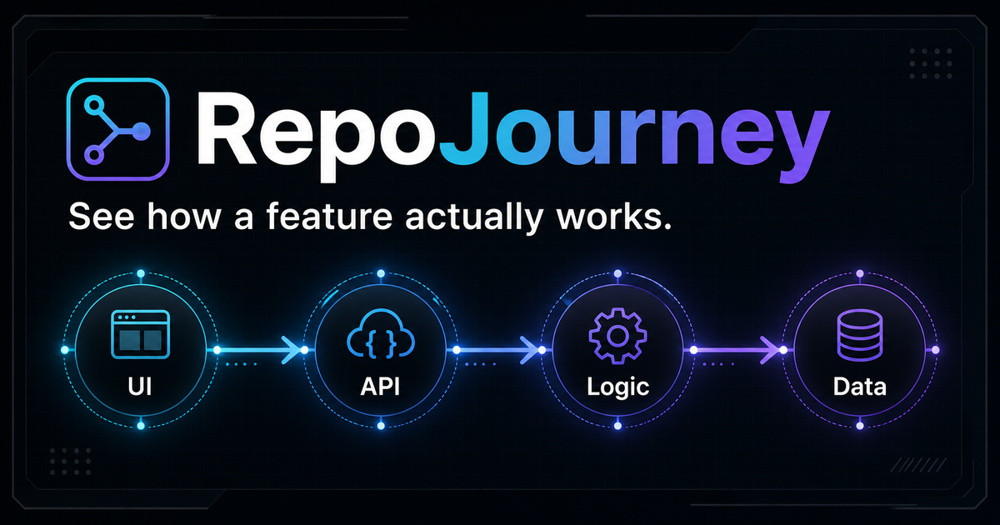

# RepoJourney

> See how a feature actually works — from click to database.

RepoJourney turns a repository into an interactive, evidence-linked map of real user journeys across interfaces, client actions, APIs, domain logic, and data.



## Why RepoJourney?

Most code maps answer **where files are**. RepoJourney is designed to answer **how a feature behaves**:

- How does a customer create a booking?
- What happens after the payment provider calls back?
- Which code is involved in the login flow?
- What could break if this service changes?

Every journey node points back to a source file and line so the explanation remains inspectable.

## Current alpha

The current release can analyze public GitHub repositories with a bounded, read-only heuristic engine:

- clone a public repository into a temporary directory;
- index supported source files with strict file, byte, and time limits;
- rank up to three code journeys using imports, source structure, and naming signals;
- inspect UI, API, domain, and database evidence nodes;
- open every evidence node at its GitHub file and line;
- export the selected journey as Mermaid context;
- show honest coverage scores and explain heuristic connections.

This is intentionally an MVP rather than semantic AI code understanding. Large repositories are sampled, private repositories are rejected, and inferred relationships are labeled as heuristics.

## Quick start

```bash
git clone https://github.com/Worshiper-lab/repojourney.git
cd repojourney
npm install
npm run start:api
```

In a second terminal:

```bash
npm run dev:static
```

Then open the local URL printed by Vite.

## Product principles

1. **Behavior before structure** — start with a feature or user question, not a directory tree.
2. **Evidence over confidence** — every claim should resolve to source.
3. **Local-first analysis** — private source should not need to leave the developer's machine.
4. **Agent-ready output** — journeys should be useful to people and coding agents alike.
5. **Visible uncertainty** — incomplete coverage should be shown, not filled with guesses.

## Roadmap

- [x] Interactive journey explorer
- [x] Evidence detail panel
- [x] Mermaid context export
- [x] Responsive product shell
- [x] Public GitHub repository ingestion
- [x] Local import and source-signal graph
- [ ] Evidence-linked natural-language questions
- [ ] Change-impact and related-test suggestions
- [ ] Local repository CLI
- [ ] MCP server for coding agents

## Stack

- TypeScript
- React 19
- Vinext and Vite
- Tailwind CSS
- shadcn/ui primitives
- Lucide icons
- Cloudflare Workers-compatible output

## Contributing

Ideas, bug reports, and focused pull requests are welcome. Please read [CONTRIBUTING.md](./CONTRIBUTING.md) before starting a larger change.

## License

[MIT](./LICENSE)
